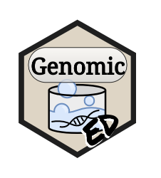

<!-- README.md is generated from README.Rmd. Please edit that file -->

```{r, include = FALSE}
knitr::opts_chunk$set(
  collapse = TRUE,
  comment = "#>",
  fig.path = "man/figures/README-",
  out.width = "100%"
)
```

# GenomicED <a href='https://nchanard.github.io/GenomicED/'></a>

<!-- badges: start -->

<!-- badges: end -->

GenomicED is a data package for [Genomic2DTK](https://github.com/NChanard/Genomic2DTK) examples.

## Installation

You can install the development version of GenomicED from [GitHub](https://github.com/) with:

``` r
devtools::install_github("NChanard/GenomicED")
```

## Documentation

[GenomicED](https://nchanard.github.io/GenomicED/)

